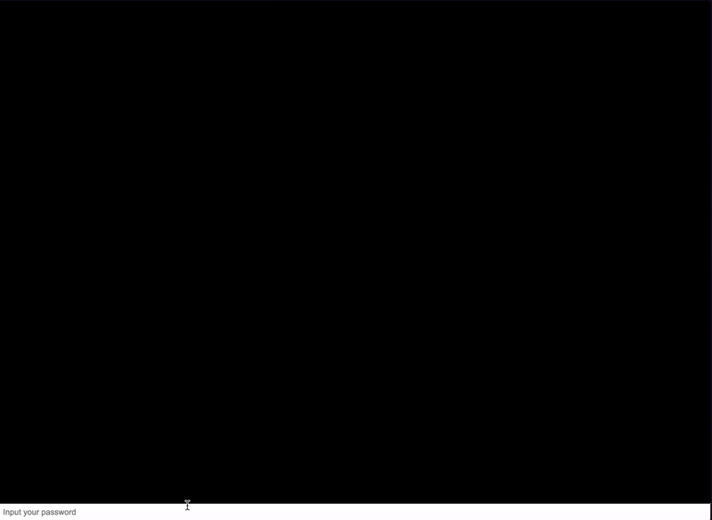

# Babyasm

Category: REVERSE ENGINEERING

Author: zx

## Description:

* Can you unlock it?

* Server: http://103.3.61.46/TetCTF2024-babyasm/babyasm.html

## Solution

### Analysing the website

We are presented with a website which takes in an input and returns whether it is wrong or right. 




### Analysing the source code

When we inspect it, we are presented with a `babyasm.html`.

The file is found under Inspect > 103.3.61.46 > TetCTF2024-babyasm > babasm.html

When looking at `babyasm.html`, we notice this particular lines of code:

```html
code = [0,97,115,109,1,0,0,0,1,56,9,80,0,95,1,127,1,80,0,94,99,0,1,96,0,0,96,1,127,1,100,1,96,3,99,1,127,127,0,96,2,99,1,127,1,127,96,4,99,1,127,127,127,0,96,1,99,1,1,127,96,1,99,1,1,127,3,8,7,2,3,4,5,6,7,8,6,118,20,127,1,65,224,0,11,127,1,65,229,0,11,127,1,65,20,11,127,1,65,177,1,11,127,1,65,155,1,11,127,1,65,244,0,11,127,1,65,236,0,11,127,1,65,197,0,11,127,1,65,212,0,11,127,1,65,237,0,11,127,1,65,231,0,11,127,1,65,238,0,11,127,1,65,239,0,11,127,1,65,223,0,11,127,1,65,244,0,11,127,1,65,231,0,11,127,1,65,225,0,11,127,1,65,200,0,11,127,1,65,20,11,127,1,65,59,11,7,45,7,1,49,0,0,4,105,110,105,116,0,1,10,97,114,114,97,121,95,102,105,108,108,0,2,1,51,0,3,1,52,0,4,1,53,0,5,5,99,104,101,99,107,0,6,10,184,8,7,142,1,0,35,0,65,19,115,36,0,35,1,65,55,115,36,1,35,2,65,32,115,36,2,35,3,65,36,115,36,3,35,4,65,19,115,36,4,35,5,65,55,115,36,5,35,6,65,32,115,36,6,35,7,65,36,115,36,7,35,8,65,19,115,36,8,35,9,65,55,115,36,9,35,10,65,32,115,36,10,35,11,65,36,115,36,11,35,12,65,19,115,36,12,35,13,65,55,115,36,13,35,14,65,32,115,36,14,35,15,65,36,115,36,15,35,16,65,19,115,36,16,35,17,65,55,115,36,17,35,18,65,32,115,36,18,35,19,65,36,115,36,19,11,9,0,32,0,251,7,1,16,0,11,22,0,32,0,32,1,32,2,65,19,106,65,64,107,251,0,0,65,1,251,16,1,11,13,0,32,0,32,1,251,11,1,251,2,0,0,11,109,0,32,1,65,0,70,4,64,32,0,32,2,32,0,32,2,16,3,32,3,106,65,32,115,16,2,5,32,1,65,1,70,4,64,32,0,32,2,32,0,32,2,16,3,32,3,106,65,36,115,16,2,5,32,1,65,2,70,4,64,32,0,32,2,32,0,32,2,16,3,32,3,106,65,19,115,16,2,5,32,1,65,3,70,4,64,32,0,32,2,32,0,32,2,16,3,32,3,106,65,55,115,16,2,11,11,11,11,11,172,3,1,1,127,32,0,65,0,16,3,65,137,175,2,70,4,64,32,1,65,1,106,33,1,5,11,32,0,65,1,16,3,65,200,4,70,4,64,32,1,65,1,106,33,1,11,32,0,65,2,16,3,65,226,5,70,4,64,32,1,65,1,106,33,1,11,32,0,65,3,16,3,65,194,173,2,70,4,64,32,1,65,1,106,33,1,11,32,0,65,4,16,3,65,193,242,3,70,4,64,32,1,65,1,106,33,1,11,32,0,65,5,16,3,65,135,5,70,4,64,32,1,65,1,106,33,1,11,32,0,65,6,16,3,65,193,6,70,4,64,32,1,65,1,106,33,1,11,32,0,65,7,16,3,65,242,240,3,70,4,64,32,1,65,1,106,33,1,11,32,0,65,8,16,3,65,166,243,2,70,4,64,32,1,65,1,106,33,1,11,32,0,65,9,16,3,65,238,3,70,4,64,32,1,65,1,106,33,1,11,32,0,65,10,16,3,65,151,5,70,4,64,32,1,65,1,106,33,1,11,32,0,65,11,16,3,65,229,241,2,70,4,64,32,1,65,1,106,33,1,11,32,0,65,12,16,3,65,225,139,4,70,4,64,32,1,65,1,106,33,1,11,32,0,65,13,16,3,65,129,5,70,4,64,32,1,65,1,106,33,1,11,32,0,65,14,16,3,65,151,6,70,4,64,32,1,65,1,106,33,1,11,32,0,65,15,16,3,65,174,137,4,70,4,64,32,1,65,1,106,33,1,11,32,0,65,16,16,3,65,225,149,2,70,4,64,32,1,65,1,106,33,1,11,32,0,65,17,16,3,65,177,4,70,4,64,32,1,65,1,106,33,1,11,32,0,65,18,16,3,65,161,5,70,4,64,32,1,65,1,106,33,1,11,32,0,65,19,16,3,65,234,147,2,70,4,64,32,1,65,1,106,33,1,11,32,1,65,20,70,4,127,65,1,5,65,0,11,11,218,2,0,32,0,65,0,65,1,32,0,65,0,16,3,35,0,106,16,4,32,0,65,1,65,2,32,0,65,1,16,3,35,1,107,16,4,32,0,65,2,65,3,32,0,65,2,16,3,35,2,108,16,4,32,0,65,3,65,0,32,0,65,3,16,3,35,3,115,16,4,32,0,65,0,65,5,32,0,65,4,16,3,35,4,106,16,4,32,0,65,1,65,6,32,0,65,5,16,3,35,5,107,16,4,32,0,65,2,65,7,32,0,65,6,16,3,35,6,108,16,4,32,0,65,3,65,4,32,0,65,7,16,3,35,7,115,16,4,32,0,65,0,65,9,32,0,65,8,16,3,35,8,106,16,4,32,0,65,1,65,10,32,0,65,9,16,3,35,9,107,16,4,32,0,65,2,65,11,32,0,65,10,16,3,35,10,108,16,4,32,0,65,3,65,8,32,0,65,11,16,3,35,11,115,16,4,32,0,65,0,65,13,32,0,65,12,16,3,35,12,106,16,4,32,0,65,1,65,14,32,0,65,13,16,3,35,13,107,16,4,32,0,65,2,65,15,32,0,65,14,16,3,35,14,108,16,4,32,0,65,3,65,12,32,0,65,15,16,3,35,15,115,16,4,32,0,65,0,65,17,32,0,65,16,16,3,35,16,106,16,4,32,0,65,1,65,18,32,0,65,17,16,3,35,17,107,16,4,32,0,65,2,65,19,32,0,65,18,16,3,35,18,108,16,4,32,0,65,3,65,16,32,0,65,19,16,3,35,19,115,16,4,32,0,16,5,11,0,45,4,110,97,109,101,1,38,7,0,1,49,1,4,105,110,105,116,2,10,97,114,114,97,121,95,102,105,108,108,3,1,51,4,1,52,5,1,53,6,5,99,104,101,99,107];            

const byte_code = new Uint8Array(code);
const wasmModule = new WebAssembly.Module(byte_code);
const wasmInstance = new WebAssembly.Instance(wasmModule, {});
const wasm = wasmInstance.exports;
```

We notice that a byte code is taken in and then run as a web assembly.

#### What is Web Assembly?

WebAssembly, often abbreviated as wasm, is a binary instruction format designed as a portable compilation target for high-level programming languages. 

It is a low-level bytecode that runs with near-native performance and can be executed in a virtual machine. WebAssembly is designed to be a universal compilation target, allowing developers to write programs in languages like C, C++, and Rust and run them on the web.

And coincidentally, the Web Assembly code can be found under Inspect > wasm > 8fa74aba. 

### Analysing source code (Part 2 😲)

Furthermore, we can see that our input is accepted using this function: 

```js
inputField.addEventListener('keydown', function (event) {
      if (event.key === 'Enter') {
        const inputText = inputField.value;
        processInput(inputText);
        inputField.value = '';
      }
    });
```

And a few checks are being done to the input. 

```js
function processInput(text) {
      const p = document.createElement('p');
      if (text.startsWith('TetCTF{') && text.endsWith('}') && text.length === 27) {

        let array_size= 20;
        let array_obj = wasm.init(array_size);
        
        for (var i = 0; i < array_size; i++) {
          wasm.array_fill(array_obj, i, text.charCodeAt(i+7));
        }
        if (wasm.check(array_obj )){
          p.textContent = '> Correct!';
        } else {
          p.textContent = '> Incorrect!';
        }
      } else {
        p.textContent = '> Incorrect!';
      }
      consoleDiv.appendChild(p);
      consoleDiv.scrollTop = consoleDiv.scrollHeight;
    }
```

It seems that, for it to return `'> Correct!'`, the input has to start with  `'TetCTF{'`, ends with `'}'` and is 27 characters long. It seems like our input is actually the flag itself! 

Following that, an array size of 20 is initialised with the wasm function. Lets look at the wasm init function!

```wasm
(func $init (;1;) (export "init") (param $var0 i32) (result (ref $type1))
    local.get $var0
    array.new_default $type1
    call $1
  )
```

hmmm... the init function seems to call another function $1 at the end... let's see what that function does.

```wasm
(module
  (type $type0 (struct (field $field0 (mut i32))))
  (type $type1 (array (field (mut (ref null $type0)))))
  (global $global0 (mut i32) (i32.const 96))
  (global $global1 (mut i32) (i32.const 101))
  (global $global2 (mut i32) (i32.const 20))
  (global $global3 (mut i32) (i32.const 177))
  (global $global4 (mut i32) (i32.const 155))
  (global $global5 (mut i32) (i32.const 116))
  (global $global6 (mut i32) (i32.const 108))
  (global $global7 (mut i32) (i32.const 69))
  (global $global8 (mut i32) (i32.const 84))
  (global $global9 (mut i32) (i32.const 109))
  (global $global10 (mut i32) (i32.const 103))
  (global $global11 (mut i32) (i32.const 110))
  (global $global12 (mut i32) (i32.const 111))
  (global $global13 (mut i32) (i32.const 95))
  (global $global14 (mut i32) (i32.const 116))
  (global $global15 (mut i32) (i32.const 103))
  (global $global16 (mut i32) (i32.const 97))
  (global $global17 (mut i32) (i32.const 72))
  (global $global18 (mut i32) (i32.const 20))
  (global $global19 (mut i32) (i32.const 59))
  (func $1 (;0;) (export "1")
    global.get $global0
    i32.const 19
    i32.xor
    global.set $global0
    global.get $global1
    i32.const 55
    i32.xor
    global.set $global1
    global.get $global2
    i32.const 32
    i32.xor
    global.set $global2
    global.get $global3
    i32.const 36
    i32.xor
    global.set $global3
    global.get $global4
    i32.const 19
    i32.xor
    global.set $global4
    global.get $global5
    i32.const 55
    i32.xor
    global.set $global5
    global.get $global6
    i32.const 32
    i32.xor
    global.set $global6
    global.get $global7
    i32.const 36
    i32.xor
    global.set $global7
    global.get $global8
    i32.const 19
    i32.xor
    global.set $global8
    global.get $global9
    i32.const 55
    i32.xor
    global.set $global9
    global.get $global10
    i32.const 32
    i32.xor
    global.set $global10
    global.get $global11
    i32.const 36
    i32.xor
    global.set $global11
    global.get $global12
    i32.const 19
    i32.xor
    global.set $global12
    global.get $global13
    i32.const 55
    i32.xor
    global.set $global13
    global.get $global14
    i32.const 32
    i32.xor
    global.set $global14
    global.get $global15
    i32.const 36
    i32.xor
    global.set $global15
    global.get $global16
    i32.const 19
    i32.xor
    global.set $global16
    global.get $global17
    i32.const 55
    i32.xor
    global.set $global17
    global.get $global18
    i32.const 32
    i32.xor
    global.set $global18
    global.get $global19
    i32.const 36
    i32.xor
    global.set $global19
  )
```

Wow! That is really long, however, if you look carefull at the code, there are two parts to the code. The first part seems to add numbers to a array. The second part seems to cycle through that array and xors each individual number with another different number. The python equivilant to this code would look something like this: 

```python
def __init__():
    array1 = [96,101,20,177,155,116,108,69,84,109,103,110,111,95,116,103,97,72,20,59]
    array2 = [19,55,32,36,19,55,32,36,19,55,32,36,19,55,32,36,19,55,32,36]
    global_arr = [0,0,0,0,0,0,0,0,0,0,0,0,0,0,0,0,0,0,0,0]
    
    for i in range(len(array)):
        global_arr[i] = array1[i] ^ array2[i]
    return global_arr
```

Notice how both arrays have a length of 20, which matches when the array_size in `babyasm.html`. 

Moving on, we see that the array of length 20 created earlier is filled up. If our input is TetCTF{AAAAAAAAAAAAAAAAAAA}, the array would look this this:\
(ord('A') -> 65, ord('}') -> 125)\
[65,65,65,65,65,65,65,65,65,65,65,65,65,65,65,65,65,65,65,125]

```js
for (var i = 0; i < array_size; i++) {
          wasm.array_fill(array_obj, i, text.charCodeAt(i+7));
        }
```

looking into the wasm array_fill program, we see that each number is added (19) and subracted (-64). Hence the python equivilant of the wasm function array_fill is:
```python
def array_fill(index, value): # array[index] = value+83
        return array[index] = value + 19 - (-64)
```

Moving on, we can see another check is being made.
```js
if (wasm.check(array_obj )){
        p.textContent = '> Correct!';
    } else {
        p.textContent = '> Incorrect!';
    }
```

This check is made using the wasm check function, to see what it does, we have to look into the code. 

```wasm
(func $check (;6;) (export "check") (param $var0 (ref null $type1)) (result i32)
    local.get $var0
    i32.const 0
    i32.const 1
    local.get $var0
    i32.const 0
    call $3
    global.get $global0
    i32.add
    call $4
    local.get $var0
    i32.const 1
    i32.const 2
    local.get $var0
    i32.const 1
    call $3
    global.get $global1
    i32.sub
    call $4
    local.get $var0
    i32.const 2
    i32.const 3
    local.get $var0
    i32.const 2
    call $3
    global.get $global2
    i32.mul
    call $4
    local.get $var0
    i32.const 3
    i32.const 0
    local.get $var0
    i32.const 3
    call $3
    global.get $global3
    i32.xor
    call $4
    
    ...

    local.get $var0
    i32.const 1
    i32.const 18
    local.get $var0
    i32.const 17
    call $3
    global.get $global17
    i32.sub
    call $4
    local.get $var0
    i32.const 2
    i32.const 19
    local.get $var0
    i32.const 18
    call $3
    global.get $global18
    i32.mul
    call $4
    local.get $var0
    i32.const 3
    i32.const 16
    local.get $var0
    i32.const 19
    call $3
    global.get $global19
    i32.xor
    call $4
    local.get $var0
    call $5
  )
```

wow... Its another long code 😵‍💫

But looking at it carefully, we can spot a few patterns. The patterns goes like this: 

```wasm
local.get $var0
i32.const X ;;where X  0->1->2->3->0->1->2->3->0...
i32.const Y ;;where Y 0<=Y<=20 but multiple of 4s are -4
;;e.g. 0->1->2->3->0->5->6->7->4->9->10->11->8->13...
local.get $var0
i32.const Z ;;where 1<=Z<=19
call $3
global.get $globalZ ;;where 1<=Z<=19
i32.AAA ;;where AAA add->sub->mul->xor->add->sub...
call $4
```

And as we can see, the code first calls $var0 which is the array, and then constant X and Y then $var0 again, before calling Z. This is where the first function $3 is called. what does function $3 do?

```wasm
(func $3 (;3;) (export "3") (param $var0 (ref null $type1)) (param $var1 i32) (result i32)
    local.get $var0
    local.get $var1
    array.get $type1
    struct.get $type0 $field0
  )
```

Function $3 takes in two inputs, $var0 and $var1. So it basically takes in the last 2 values which are the array and the number Z. It then gets these two variables, and an additional $type1, which is an array, and then gets the value from the array at index Z.

The python equivilant of function 3 will be:

```python
def three(array, index): # gets the value of the array at index
        return array[index]
```

Going back to the check function, it gets $globalZ which is the value of the global array at index Z and then either adds, subtracts, multiplies, of xor. 

The function $4 is called.

```wasm
(func $4 (;4;) (export "4") (param $var0 (ref null $type1)) (param $var1 i32) (param $var2 i32) (param $var3 i32)
    local.get $var1
    i32.const 0
    i32.eq
    if
      local.get $var0
      local.get $var2
      local.get $var0
      local.get $var2
      call $3
      local.get $var3
      i32.add
      i32.const 32
      i32.xor
      call $array_fill
    else
      local.get $var1
      i32.const 1
      i32.eq
      if
        local.get $var0
        local.get $var2
        local.get $var0
        local.get $var2
        call $3
        local.get $var3
        i32.add
        i32.const 36
        i32.xor
        call $array_fill
      else
        local.get $var1
        i32.const 2
        i32.eq
        if
          local.get $var0
          local.get $var2
          local.get $var0
          local.get $var2
          call $3
          local.get $var3
          i32.add
          i32.const 19
          i32.xor
          call $array_fill
        else
          local.get $var1
          i32.const 3
          i32.eq
          if
            local.get $var0
            local.get $var2
            local.get $var0
            local.get $var2
            call $3
            local.get $var3
            i32.add
            i32.const 55
            i32.xor
            call $array_fill
          end
        end
      end
    end
  )
```

Funtion 4 takes in 4 parameters $var0, $var1, $var2, $var3. Which are the array, the X, Y and the result of the addition/subtraction/multiplication/xor. 

We can see function 4 does a couple of if else checks. More specifically, it checks if X is 0, 1, 2 or 3. And depending on that, it xors a different value at the end, which are 32, 36, 19, and 55 respectively. 

From the code, we can see that it gets a array, the Y value, the array and the Y value again, before calling function $3, and from what we found out above, it returns array[Y] which is basically the value in front of the current value on the array. 

It then gets the result of the addition/subtraction/multiplication/xor and adds them together before xoring them with its respective value. 

It then uses the function array_fill, and from what we found out above, it just adds 18 and subtracts (-64) before adding it back to the array. 

Hence, the python equivilant would look something like this.

```python
def four(array, index, indexplus1, arrayval):
  if index == 0:
    indexp1_val = three(indexplus1) 
    temp = arrayval + indexp1_val
    temp = temp ^ 32 #xored with 32
    self.array_fill(indexplus1, temp)
  elif index == 1:
    indexp1_val = three(indexplus1) 
    temp = arrayval + indexp1_val
    temp = temp ^ 36 #xored with 36
    self.array_fill(indexplus1, temp)
  elif index == 2:
    indexp1_val = three(indexplus1) 
    temp = arrayval + indexp1_val
    temp = temp ^ 19 #xored with 19
    self.array_fill(indexplus1, temp)
  elif index == 3:
    indexp1_val = three(indexplus1) 
    temp = arrayval + indexp1_val
    temp = temp ^ 55 #xored with 55
    self.array_fill(indexplus1, temp)
```

We are very close to the end, before the check ends, it calls one last function called $5.

```wasm
(func $5 (;5;) (export "5") (param $var0 (ref null $type1)) (result i32)
    (local $var1 i32)
    local.get $var0
    i32.const 0
    call $3
    i32.const 38793
    i32.eq
    if
      local.get $var1
      i32.const 1
      i32.add
      local.set $var1
    else
    end
    local.get $var0
    i32.const 1
    call $3
    i32.const 584
    i32.eq
    if
      local.get $var1
      i32.const 1
      i32.add
      local.set $var1
    end

    ...

    local.get $var0
    i32.const 19
    call $3
    i32.const 35306
    i32.eq
    if
      local.get $var1
      i32.const 1
      i32.add
      local.set $var1
    end
    local.get $var1
    i32.const 20
    i32.eq
    if (result i32)
      i32.const 1
    else
      i32.const 0
    end
  )
```

Its another long code, but its really simple. It goes through the values our array and checks it against the answer array. if its wrong, it will end the program, else if it is right it will add one to a $var1. at the end, if $var1 is 20, one is returned and the check would evaluate to True.

The python equivilant would look something like this:

```python
def five(array):
  answer = [38793,584,738,38594,63809,647,833,63602,47526,494,663,47333,67041,641,791,66734,35553,561,673,35306]
  var = 0
  for i in range(19):
    if array[i] == answer[i]:
      var = var + 1
    else:
      sys.exit(0)
  
  if var == 20:
    return 1 # accepted
  else:
    return 0 # rejected
```

So from here, we can see the answer, and the answer is essentially our encoded flag! All we need to do is is reverse the encoding!

Before that, lets piece all our python equivliant code together to create a cohesive code that we can use to test our test inputs

```python
import sys

class babyasm(): 
    def __init__(self, array):
        self.array = array
        self.array = [ord(i) for i in self.array]

        array1 = [96,101,20,177,155,116,108,69,84,109,103,110,111,95,116,103,97,72,20,59]
        array2 = [19,55,32,36,19,55,32,36,19,55,32,36,19,55,32,36,19,55,32,36]
        self.global_arr = [0,0,0,0,0,0,0,0,0,0,0,0,0,0,0,0,0,0,0,0]
        
        for i in range(len(array1)):
            self.global_arr[i] = array1[i] ^ array2[i]
        

    def array_fill(self, index, value): # array[index] = value+83
        self.array[index] = value + 19 - (-64)

    def three(self, index): # gets the value of the array at index
        return self.array[index]

    def four(self, index, indexplus1, arrayval):
        if index == 0:
            indexp1_val = self.three(indexplus1) 
            temp = arrayval + indexp1_val
            temp = temp ^ 32 #xored with 32
            self.array_fill(indexplus1, temp)
        elif index == 1:
            indexp1_val = self.three(indexplus1) 
            temp = arrayval + indexp1_val
            temp = temp ^ 36 #xored with 36
            self.array_fill(indexplus1, temp)
        elif index == 2:
            indexp1_val = self.three(indexplus1) 
            temp = arrayval + indexp1_val
            temp = temp ^ 19 #xored with 19
            self.array_fill(indexplus1, temp)
        elif index == 3:
            indexp1_val = self.three(indexplus1) 
            temp = arrayval + indexp1_val
            temp = temp ^ 55 #xored with 55
            self.array_fill(indexplus1, temp)

    def five(self):
        answer = [38793,584,738,38594,63809,647,833,63602,47526,494,663,47333,67041,641,791,66734,35553,561,673,35306]
        var = 0
        for i in range(19):
            if self.array[i] == answer[i]:
                var = var + 1
            else:
                sys.exit(0)
        
        if var == 20:
            return 1 # accepted
        else:
            return 0 # rejected
    
    def check(self):
        for i in range(20):
            # for num in self.array: print(num)
            # print("")
            remainder = i%4
            if remainder == 0:
                temp = self.global_arr[i] + self.three(i)
                self.four(i%4, i+1, temp)
            elif remainder == 1:
                temp = self.three(i) - self.global_arr[i]
                print(self.three(i), self.global_arr[i])
                self.four(i%4, i+1, temp)
            elif remainder == 2:
                temp = self.global_arr[i] * self.three(i)
                self.four(i%4, i+1, temp)
            elif remainder == 3:
                temp = self.global_arr[i] ^ self.three(i)
                self.four(i%4, i+1-4, temp)
        self.five()
	
test = babyasm(['A','B','A','A','A','A','A','A','A','A','A','A','A','A','A','A','A','A','A','}'])
for i in range(len(test.array)):
    test.array_fill(i, test.array[i])
test.check()
print(test.array)
```

Note that I used a class so that the array can be access by all functions. 

### Reversing the code
Reversing the code is relatively simple. First we turn all values of the array with the index that are multiple of 4s back into normal by reversing the process. Then, we do the same with index%4 == 1, then index%4 == 2 and finally index%4 == 3. 

Once the array is finished, it is turned into ascii and printed out on the terminal. 

```python
class reverse():
    def __init__(self, array):
        self.array = array
        self.newarray = [0,0,0,0,0,0,0,0,0,0,0,0,0,0,0,0,0,0,0,0]

        array1 = [96,101,20,177,155,116,108,69,84,109,103,110,111,95,116,103,97,72,20,59]
        array2 = [19,55,32,36,19,55,32,36,19,55,32,36,19,55,32,36,19, 55,32,36]
        self.global_arr = [0,0,0,0,0,0,0,0,0,0,0,0,0,0,0,0,0,0,0,0]
        
        for i in range(len(array1)):
            self.global_arr[i] = array1[i] ^ array2[i]
    
    def array_unfill(self, index):
        return self.array[index] - 19 + (-64)

    def three(self, index): # gets the value of the array at index
        return self.array[index]

    def reverse_four(self, index, indexplus1, arrayval=None):
        if index==0:
            temp = self.array_unfill(indexplus1)
            temp = temp ^ 32
            temp = temp - arrayval
            self.newarray[indexplus1] = temp
            print(self.newarray)
            pass
        elif index==1:
            temp = self.array_unfill(indexplus1)
            temp = temp ^ 36
            temp = temp - arrayval
            self.newarray[indexplus1] = temp
            print(self.newarray)
            pass
        elif index==2:
            temp = self.array_unfill(indexplus1)
            temp = temp ^ 19
            temp = temp - arrayval
            self.newarray[indexplus1] = temp
            print(self.newarray)
        elif index==3:
            temp = self.array_unfill(indexplus1)
            temp = temp ^ 55
            temp = temp - arrayval
            self.newarray[indexplus1] = temp
            print(self.newarray)

    def check_reverse(self):
        for i in range(19, -1, -4):
            temp = self.global_arr[i] ^ self.three(i)
            self.reverse_four(i%4, i+1-4, temp)

        for i in range(0, 20, 4):
            temp = self.global_arr[i] + self.newarray[i]
            self.reverse_four(i%4, i+1, temp)

        for i in range(1, 20, 4):
                temp = self.three(i) - self.global_arr[i]
                self.reverse_four(i%4, i+1, temp)

        for i in range(2, 20, 4):
                temp = self.three(i) * self.global_arr[i]
                self.reverse_four(i%4, i+1, temp)

    def toascii(self):
        text = ""
        for i in self.newarray:
            text += chr(i - 19 + (-64))
        print(text)

reversed=reverse([38793,584,738,38594,63809,647,833,63602,47526,494,663,47333,67041,641,791,66734,35553,561,673,35306])
reversed.check_reverse()
reversed.toascii()    
```

Flag: `TetCTF{WebAss3mblyMystique}`