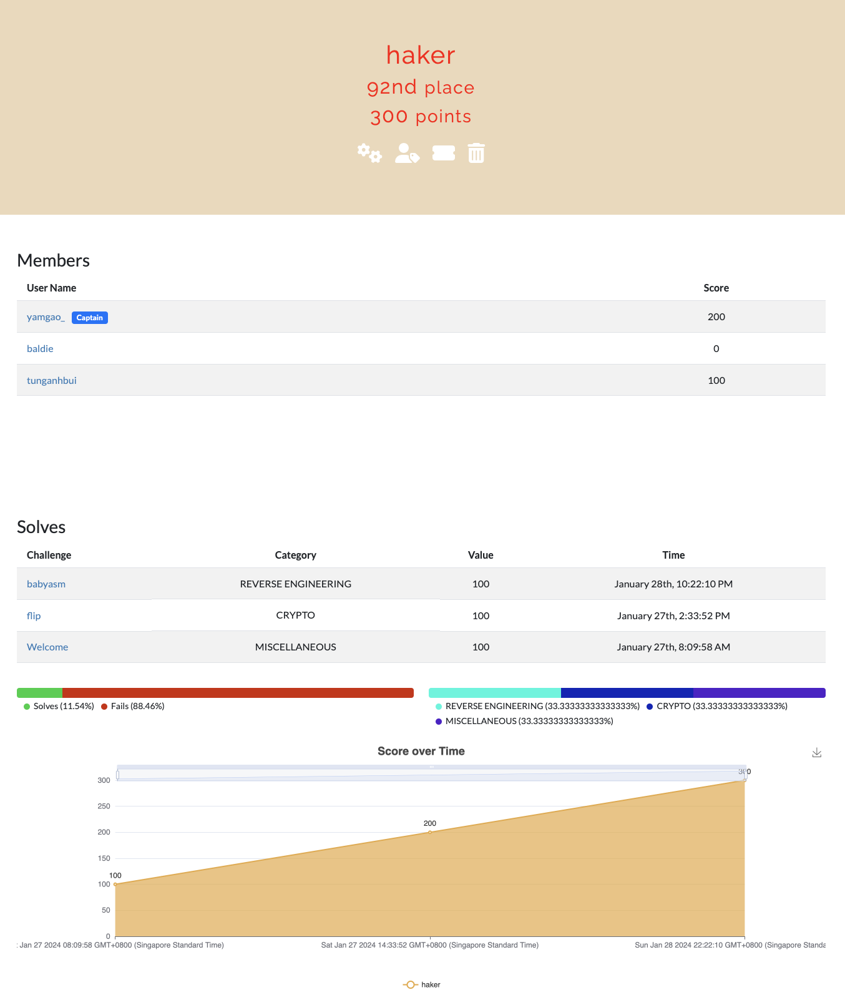

# Hello 👋

TetCTF is my first CTF challenge after studying CTF for 3 weeks. It was really an eye opening experience, throughout TetCTF I was exposed to a diverse range of challenges ranging from cryptography to reverse engineering. 

Reflecting on my experience on TetCTF, it served as an important benchmark in my CTF journey and I hope to learn even more about Cybersecurity in the future. 

Attached are my writeups and files of the two ctf challenges I successfully completed - flip and babyasm. It may not have been the most effecient method but it is was the thought process I had when solving it. 

